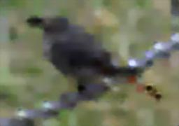
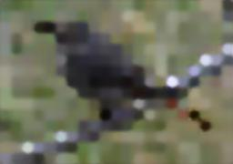
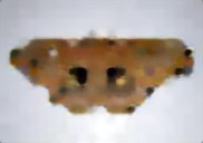
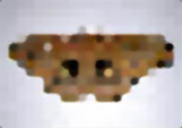
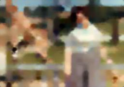
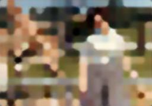

# CMPM202 classProject 
## About: 
This project includes two parts,  a recurrent neural network, and an autoencoder modified for class purposes.
please see the descriptions below for both parts. 

## part1 - RNN and generating text 
In part one of the project, we implemented a recurrent neural network using tensorflow to generate text. We followed and modified the tutorial found at https://www.tensorflow.org/tutorials/sequences/text_generation

We ran the code with text pieces from various resources. including books and musicals
Sample generated text includes: 

* Lord of the rings book
* musicals ( Hamilton and wicked), 
* and a game of thrones. 

All text is formatted in a way that fits its category; as an example, we formatted Hamilton and Wicked lyrics to include characters between brackets and increased spacing between segments. 


### running the code: 

To run part one of the project, please install the required dependencies mainly *tensorflow*(1.2), *numpy* and *nightlye* for compatibility issues and traverse into part one of the directory. 

```
install pip  install -q tf-nightlye
```

to run all the samples mentioned above, run the ``` python autorun.py_  ``` script without any parameters 

### Sample output: 
**Lord of the rings**

with Epoch 3, nonsical text was produced
> It waste nongey flotly. It mom the astre, ma, cronden hians, on yay the, in th wack tht de, butors wrouthed been res afordote, op dhilbechnm' anbi par ftam amd turbe high to ho co mooks wouthe llatither and he dipep lofen. 

with Epoch 5, more training: 

>The hope of the darkness were steader. 
Sam darkness. 
 'All that day that the hobbits came on the hill '
  'and suddenly the hill of the Great Elves that '
 'fell sunding to the top of the thing hobbits '
  'were in the things had been as the land of'
  
 > 'Mr. Bilbo Baggins the others still his '
                                   'time that he had some still little from '
                                   'the heart of the hinder of the hobbits '
                                   'were seen that the Boat the shadow of the '

  
  
  
  with Epoch 25: 
 > 'As for the Enemy. I know where he is dear than you '
                        'look like home. Mr. Bilbo has len the words of Sauron '
                        'at the end of the loct the room. He drew out a sound '
                        'of many families, and a great store of peace shall I '
                        'pass through the dark, and though it was waiting on '
                        'the shore, a small ind on the far shore. \r\n'

**Hamilton and Wicked**
with Epoch = 5, 10k char 


 >
 
                       In New York you can be a new mangelica]\n'
                       " Gasps. My heart feels like it's a little perky."
                       '[linda]
                       ' Oh, how very kind, Biq.\n' 
                       '[Angelica]'
                       ' Elphaba, do something!'
                       [HAMILTON]
                      I can do anything I want. I am the Wicked '
                       

with Epoch = 25, 10k char 

> 

                                   REALLY HOPE YOU GET IT\n'
                                   "AND YOU DON'T LIVE TO LAHamilton]\n"
                                   ' They are onle veod anymore! Your whole '
                                   'life is going to change... and all because '
                                   'of me. Okay, stand... INSTINCTS\n'
                                   'CLOSE MY EYES...\n'
                                   'AND LEAP\n'
                                   "IT'S TIME TO TRY DEFYING GRAVITY\n"
                                   "I THINK I'LL THE SKY\n"
                                   'I KNOW EVERYONE DESERVES THE CHANCE TO...\n'
                                   '[HAMILTON] NO! Quick, how do I reverse '
                                   'it?\n'
                                   '[Morrible]\n'
                                   " You can't!\n"
                                   '[HAMILTON] What?!\n'
                                   '[Morrible]\n'
                                   " You can't! Spells are irreversible! I "

**Game of thrones**

> 'Now it was the first time. He could not make a '
                            'doubtful from the bench. He could see the anger '
                            'in the rocks. They were still and the stableboys '
                            'had been found there was nothing to do the words '
                            'to the room. “I don’t know my father and I might '
                            'say a man to save them to them. “What are you '
                            'come to kill a king. He wanted to know that '
                            'always be a man with a time to you.”\n'


## part2 - Autoencoder and un-pixelating images 

In part Two of the project, we altred an autoencoder provided in class by Manu Tomas, @manumathewthomas. Our goal was to train the model to smooth out pixel images. 
We modified a pixellating python script and created a pixilated data set  to use along with a clear data set. 

The data set includes more cat:cat: images than standard images, our trained model might be biased towards cats, other image samples were included though (just less). We also discovered that photos with a definite object in its focus result in a better un-pixelized photo, while pictures that include a scenery or background object were still pixelated in comparison. 


### running the code: 

If you would like to train the model with a different set of images, please nest them appropriately under dataset/train, dataset/val, and dataset/test ( both pixelated and clear images should be provided), then run
``` 
python bethsAutotester.py 
```

To use it against our trained model, please run the script from the part 2 folder: 

``` 
python test.py path/to/pixelatedFile.jpg 
```

### results:

Before training the model ( using the focus based model ) resulted in 

  

### test 1 and 2, defined below
Running the modeThis test was a CPU based test and training the model for 8 hours. 

pixelated input images: 

<p float="left">
     

  
   
</p>


output resultS: 
surprisingly, results 1 showed less pixelated images than test 2

Test 1  | Test 2
:-------------------------:|:-------------------------:
9k iterations, 32 filters, 3 kernal| 9k iterations, 62 filters, 5 kernal 
  |  
   | 
 |  


### test 0 , samples with full images and the largest iterations

Test 0: 100k iterations, 32 filters and 3 kernal size
Original image, pixelated input, de-pixelized output
<p float="left">
     

  
   
</p>

<p float="left">
     
  
   
</p>


<p float="left">
     
  
   
</p>


<p float="left">
     
  
   
</p>


### last model tested with 16k iterations

<p float="left">
  
   
</p>

<p float="left">
  
   
</p>

<p float="left">
  
   
</p>

<p float="left">
  
   
</p>


#### some background images

our model worked better for images with a foreground character, background/scenery images turned out to have an artistic flair but in most parts the image was not clear. 

<p float="left">
  
   
</p>
<p float="left">
  
   
</p>

## Credit and resources: 
 Text gen tutorial: https://www.tensorflow.org/tutorials/sequences/text_generation
 
 autoencoder base code by @manumathewthomas:https://github.com/manumathewthomas
 
 Original pixelation code:  https://gist.github.com/danyshaanan/6754465
 
### team members: 
Elisabeth Oliver @bluestar514 and Rehaf jammaz


